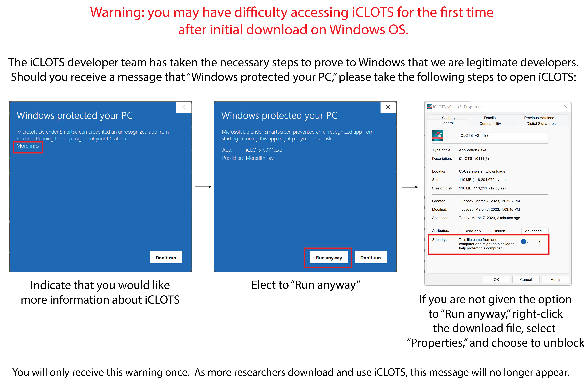

Getting started
================

| iCLOTS is available both as a Mac-based .app file and a Windows-based .exe file. 

| iCLOTS current version 0.1.1 is written in Python 3.7 and packaged natively using the open-source library Pyinstaller version 5.6.2. iCLOTS has been designed as a standalone software to reach the widest range of users possible and for potential use in clinical environments. As such, no supporting software or software dependencies are required. No additional resources are needed to run the program.

| iCLOTS is installed simply by downloading the appropriate files. Some users received errors downloading the software from the website using Microsoft Edge browser, and as such, the development team suggests using Google Chrome to download the software from the website.

.. _Mac OS downloads:

Downloading and opening iCLOTS in Mac OS
------------------------------------------

| On Mac OS, users click the tar.gz distribution file available `on our software page <https://github.com/iCLOTS/iCLOTS/releases/>`_ to open, then click the .app file to start the software.

| iCLOTS .app file has been developed on Mac OS Monterrey version 12.5.1, but has been tested on other Mac OS, including Catalina and Ventura. 

| The software is approximately ~150 MB, so may take 1-10 minutes to download, depending on internet speed. iCLOTS will take an additional 1-5 minutes to open, particularly for first time use. On Mac OS, when opening, the icon will appear and "bounce" in the dock, disappear, and reappear when the software has loaded. 

| The development team has taken the necessary steps to identify ourselves as legitimate developers. Upon opening for the first time, you may be alerted that this is a software downloaded from the internet. This is common to most open-source projects, including other bioimage analysis software like Ilastik and CellProfiler. You may also be alerted that we are a new team of developers, and asked if you trust the source of this software. The source of the software is attributed to Meredith Fay, iCLOTS lead developer. Please see a sample alert window produced by opening the software for the first time below:

| During testing, all software users received and accepted these messages, with no negative effect to their computers.

.. _Windows OS downloads:

Downloading and opening iCLOTS in Windows OS
---------------------------------------------

| On Windows OS, users click the .exe distribution file available `on our software page <https://github.com/iCLOTS/iCLOTS/releases/>`_ to download, then click again to start the software.

| iCLOTS .exe file has been developed on Windows version 11, but has been tested on other Windows versions, including Windows version 10.

| The software is approximately ~150 MB, so may take 1-10 minutes to download, depending on internet speed. iCLOTS will take an additional 1-5 minutes to open, particularly for first time use. 

| The development team has taken the necessary steps to identify ourselves as legitimate developers to Windows OS. Upon opening for the first time, you may be alerted that Windows has protected your PC. Over time, as the iCLOTS development team develops a positive relationship with Windows, this window will no longer open upon downloading. There is an option to click "More info" (image 1, below) and "Run anyways" (image 2, below) from the message window. The source of the software may will be attributed to Meredith Fay. 

| In rare cases where the user does not have adminstrative privileges on their computer, there may not be an option to "Run anyways." In this case, users should right-click on the download, select "Properties," and select to unblock the application (image 3, below). If issues with download persist, please feel free to contact the development team.

| During testing, all software users received and accepted these messages, with no negative effect to their computers.
